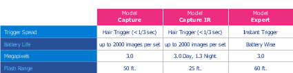

# Final Project
## About Page

This section of the final will be the second of the two most HTML/CSS intensive. Luckily, we're going to make heavy use of the Bootstrap library (which will require us to properly read their documentation).

### Expectations
* The about page should include 2 main parts plus a modal: 
  1. You should have a series of divs (can be `cards`, a series of `list-groups`, or anything else you'd prefer that will be visually impactful). This will be a series of reviews of your product from customers. Instead of using an external API, the reviews can be found in `userReviews.json` in the [assets folder](./assets/userReviews.json). You'll want to save that JSON in your js file and use that data for the following:
      1. Before you render any of the reviews to the DOM, remove any of the reviews lower than 3 stars using javascript, this is our site and we don't want anything too negative. (Note: DO NOT just remove them from the `.json`, for the sake of argument we're pretending this JSON is a response from an API and as such they couldn't be removed that easily.) 
      2. Replace all of their full names with just first names before saving it into a variable.
      3. Remove their birthdays (or censor them / replace them with a static value)
      4. Render the data with first name, rating, comments, and dates all visible and in a visually clear and pleasing manner. Try to have star icons appear for the number of stars the review gave.
      5. Allow the users to sort the reviews by date or rating (ascending or descending) via the use of either buttons or dropdown selects. The order of the reviews should change to match the new order. 
  2.  A small table comparing this service to two other fictitious services. 
      * Come up with 4 things to compare the 3 items on with your service being the only one that has all three. For any items that a service has, have that table cell be green (or a similar color). For any items that a service does NOT have, have that cell be red (or a similar color).
      * Refer to the below for reference if you're not sure how to have it look: 
  3. At the bottom of the page have a footer with your company's ficticious address with two links. One that says contact us, and one that says leave feedback.  
      * When clicked, "Contact Us" should be an email link to example@example.com.
      * "Feedback" should open up a [Boostrap modal](https://getbootstrap.com/docs/4.1/components/modal/) with
          1. A form with information you feel would be important to have on a feedback form. The minimum should be a drop down or radio buttons for 1-5 stars, first and last names, and comments.
          2. At the bottom of the modal, they should be able to submit or cancel. If they submit, compile all of the form information to an object (look at [userReviews.json](./assets/userReviews.json) for potential layout) and log it to the console before closing the modal.
